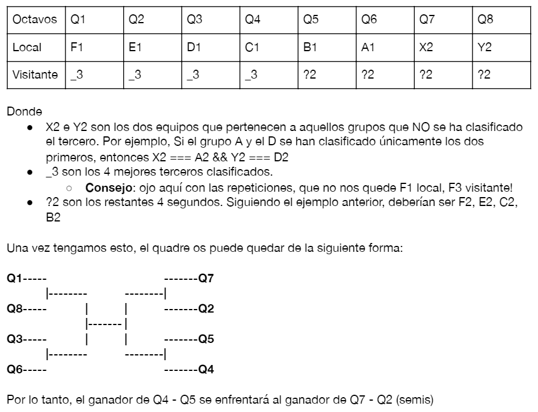

# PRÁCTICA INTRODUCCIÓN A JAVASCRIPT

---

- Práctica del bootcamp **FullStack Web Developer** de **KEEPCODING**

- Para la siguiente práctica, he usado:

  - Javascript
  - libreria [chalk](https://www.npmjs.com/package/chalk) (Para colorear console.logs())

## FUNCIONAMIENTO DE LA PRÁCTICA

---

- Debíamos crear un **simulador de la eurocopa de fútbol**

- La parte obligatoria de la práctica era crear la Fase de Eliminatorias, en la cual teniamos 16 equipos que se enfrentaban
  entre ellos de forma aleatoria e ir mostrando los resultados de cada partido.
  Se debían de ir eliminando los derrotados y clasificando a los ganadores.

- El objetivo final era obtener el nombre del ganador de la eurocopa

- Como parte opcional, debíamos crear la fase de grupos obteniendo 24 equipos de forma aleatoria e introducirlos en grupos distintos, en un total de 6 grupos (A, B, C, D, E, F)

- En esta parte opcional, debiamos implementar:

  - La muestra de grupos y equipos y las jornadas de los mismos
  - Los partidos de cada jornada y la clasificación de los equipos de la misma en una tabla

- Una vez finalizada la fase de grupos debiamos recuperar, de cada grupo:

  - Los 3 primeros clasificados de cada grupo y de los terceros de cada grupo
    seleccionar a 4 en función de:

        - Los puntos
        - Gol Average (Goles a favor - goles en contra)
        - Alfabeticamente

- Obtenidos los clasificados para los PlayOffs (Fase de Eliminatorias) debiamos de posicionarlos de tal forma que en octavos no se enfrentaran equipos del mismo grupo tal y como la siguiente imagen indica:

- Una vez tuvieramos todos los equipos posicionados, debiamos de aplicar la parte obligatoria (PlayOffs/Fase de Eliminatorias)

### OTROS DATOS

---

- Una vez clonado el repo hay 2 tags (actualmente) los cuales, haciendo **git checkout \<nombretag>** podemos ver:

  - Versión inicial (**_git checkout v1.0_**)
  - Versión coloreada (**_git checkout v1.1_**)

    > La version coloreada es la que viene por defecto cuando clonamos el repo
